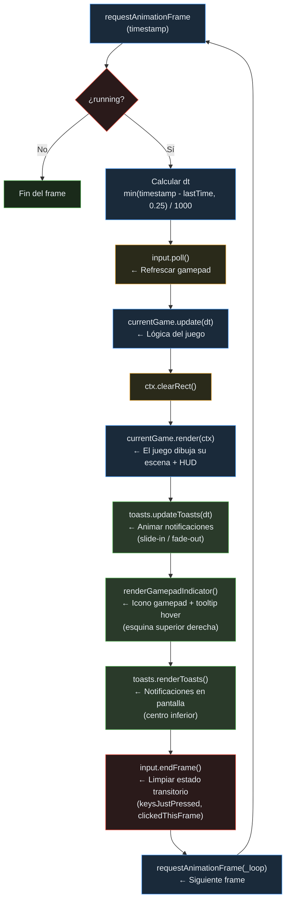
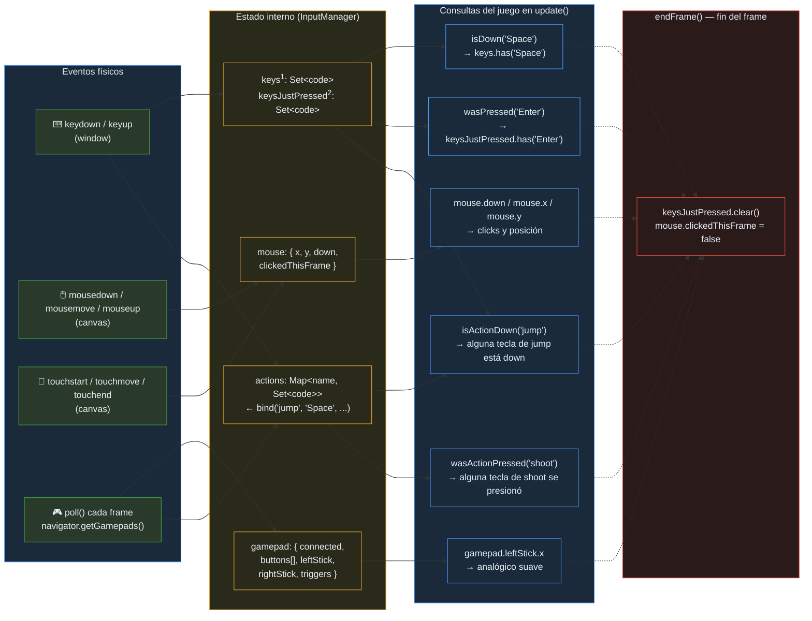
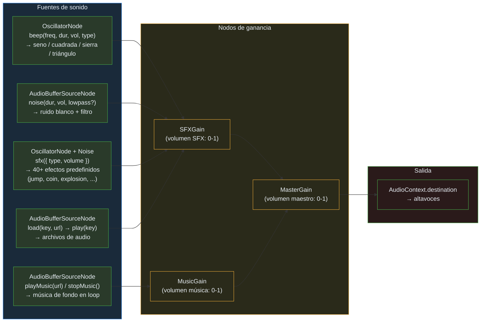
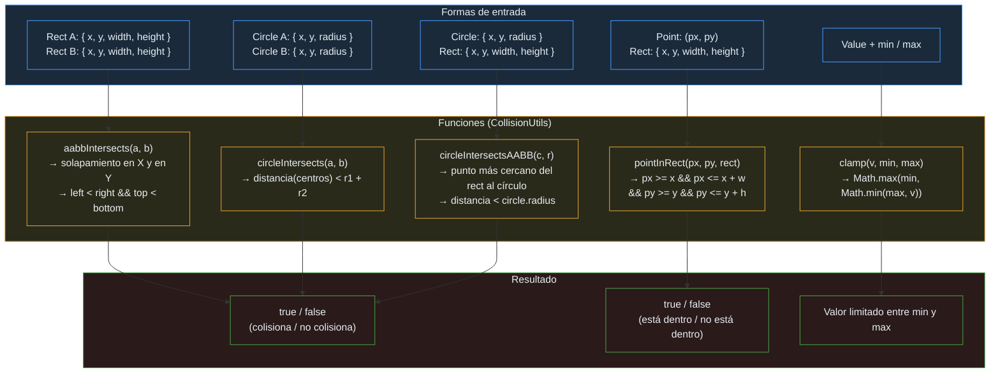

# GameHub Engine — Arquitectura Técnica

> Documentación completa del motor de juego común para los 35 juegos del GameHub Engine.
> Julio 2026.

---

## Índice

1. [Visión general](#1-visión-general)
2. [Game Engine (bucle de juego)](#2-game-engine)
3. [GameBase (clase base)](#3-gamebase)
4. [Input Manager](#4-input-manager)
5. [Audio Manager](#5-audio-manager)
6. [Haptic Manager](#6-haptic-manager)
7. [Settings Manager](#7-settings-manager)
8. [Storage Manager](#8-storage-manager)
9. [Collision Utils](#9-collision-utils)
10. [Vector 2D](#10-vector-2d)
11. [Seeded Random](#11-seeded-random)
12. [Particle System](#12-particle-system)
13. [Tilemap](#13-tilemap)
14. [Camera](#14-camera)
15. [Game UI](#15-game-ui)
16. [wrapText](#16-wraptext)
17. [i18n (internacionalización)](#17-i18n)
18. [Icon Renderer](#18-icon-renderer)
19. [Asset Loader](#19-asset-loader)
20. [Hub (main.js)](#20-hub)
21. [Patrones de uso](#21-patrones-de-uso)
22. [Flujo de carga de un juego](#22-flujo-de-carga)

---

## 1. Visión general

GameHub Engine es un motor de juegos Canvas 2D modular, sin dependencias externas. Proporciona 20+ módulos reutilizables que los juegos consumen según sus necesidades.

### Principios de diseño

- **Zero dependencias externas**: todo está escrito en JavaScript vanilla.
- **Carga bajo demanda**: cada juego se carga vía `import()` dinámico solo cuando el usuario lo selecciona.
- **Namespacing por juego**: storage, traducciones y estado están aislados por juego.
- **Interfaz uniforme**: todos los juegos implementan la misma API (`init/update/render/destroy`).
- **Singleton compartido**: AudioManager, HapticManager, SettingsManager son globales y persistidos.

### Resolución y escalado

- **Resolución base**: 900×540 píxeles (relación 16:9).
- **Escalado responsive**: el canvas se escala proporcionalmente al ancho de la ventana (máx 900px, con padding de 16px a cada lado).
- **Coordenadas internas**: los juegos siempre trabajan en coordenadas lógicas 900×540. El escalado lo maneja CSS (`canvas { width: 100%; }`).
- **InputManager** ajusta las coordenadas del ratón automáticamente usando `canvas.getBoundingClientRect()` y el factor de escala `canvas.width / rect.width`.

---

## 2. Game Engine

**Archivo**: `src/engine/GameEngine.js`

### Responsabilidad

Gestiona el bucle principal de juego usando `requestAnimationFrame` con delta time en segundos.

### API pública

```js
class GameEngine {
  constructor(canvas, { maxDt = 0.25 })
  
  loadGame(gameInstance)  // Carga un juego e inicia el loop
  unloadGame()            // Detiene el juego y llama a destroy()
  start()                 // Reanuda el loop tras stop()
  stop()                  // Pausa el loop (cancela rAF)
  resize(width, height)   // Cambia tamaño del canvas
}
```

### Bucle interno (`_loop`)

```js
_loop(timestamp) {
  const dt = Math.min((timestamp - this.lastTime) / 1000, this.maxDt);
  this.lastTime = timestamp;
  
  if (this.currentGame) {
    this.input.poll();                           // Refrescar gamepad
    this.currentGame.update(dt);
    this.ctx.clearRect(0, 0, this.canvas.width, this.canvas.height);
    this.currentGame.render(this.ctx);

    // Overlays automáticos del engine (se renderizan sobre el juego)
    this._toasts.updateToasts(dt);               // Animar toasts
    renderGamepadIndicator(this.ctx, this.input,  // Icono gamepad + tooltip
      this.canvas.width, this.input.mouse.x, this.input.mouse.y);
    this._toasts.renderToasts(this.ctx,           // Toast notifications
      this.canvas.width, this.canvas.height);

    // Limpiar estado transitorio del frame (clickedThisFrame, keysJustPressed).
    // Los juegos ya no deben llamar endFrame() manualmente.
    this.input.endFrame();
  }
  
  this._rafId = requestAnimationFrame(this._loop);
}
```

**maxDt (0.25s)**: evita el "spiral of death" tras pausas largas (cambio de pestaña, debugger). Si el frame anterior fue hace >0.25s, se trunca a 0.25s para evitar que la física salte.

### Diagrama del bucle (_loop)



**Leyenda de colores**:
- 🔵 Azul — Pasos del bucle estándar (dt, update, render, rAF)
- 🟡 Amarillo — Operaciones del engine (clearRect, poll)
- 🟢 Verde — **Overlays automáticos** (toasts, gamepad indicator) — los juegos no necesitan gestionarlos
- 🔴 Rojo — Limpieza de estado (endFrame)

### Ciclo de vida

```
constructor → (loadGame → init → [update+render]×n → unloadGame → destroy) → ...
```

El InputManager se attacha en el constructor y permanece vivo entre juegos (no se detach/attach en cada carga).

---

## 3. GameBase

**Archivo**: `src/engine/GameBase.js`

### Responsabilidad

Clase base opcional que unifica el boilerplate común de todos los juegos.

### API pública

```js
class GameBase {
  init(engine, storageKey?)   // Guarda engine, canvas, input, width, height
  handleResize(width, height) 
  destroy()                   // Vacío por defecto
  renderHUD(ctx, opts?)       // Delega en renderDefaultHUD de GameUI
  renderPauseOverlay(ctx, opts?)  // Delega en renderPauseOverlay de GameUI
  handleRestartInput(endStatuses?)  // Patrón won/lost → restart
}
```

### Propiedades establecidas en `init()`

| Propiedad | Origen | Descripción |
|-----------|--------|-------------|
| `engine` | Parámetro | Instancia de GameEngine |
| `canvas` | `engine.canvas` | Elemento canvas del DOM |
| `input` | `engine.input` | InputManager compartido |
| `width` | `canvas.width` | Ancho lógico del canvas |
| `height` | `canvas.height` | Alto lógico del canvas |
| `storage` | Nuevo StorageManager | Si se pasa storageKey |

### Auto-aplicación de bindings

Si el juego define `_defaultBindings()` como método que retorna un mapa
de acción → [teclas], `GameBase.init()` lo detecta y llama automáticamente
a `SettingsManager.applyBindings()`:

```js
class MiJuego extends GameBase {
  init(engine) {
    super.init(engine, 'mi-juego');
    // Las bindings se aplican automáticamente desde GameBase.init()
  }

  _defaultBindings() {
    return {
      moveLeft: ['ArrowLeft', 'KeyA', 'GamepadLStickLeft', 'GamepadLeft'],
      moveRight: ['ArrowRight', 'KeyD', 'GamepadLStickRight', 'GamepadRight'],
      jump: ['Space', 'KeyW', 'GamepadA'],
      shoot: ['Space', 'GamepadR1', 'GamepadX'],
    };
  }
}
```

Esto permite que el jugador reasigne teclas mediante `SettingsManager`
y los cambios se apliquen automáticamente al iniciar la partida.

### destroy()

Método vacío por defecto. Las subclases pueden sobrescribirlo para
limpiar listeners, timers o estado al descargar el juego.

### handleRestartInput

Implementa el patrón más común entre juegos: cuando `status` es 'won' o 'lost', espera Space o click y llama a `this._restart()`. Retorna `true` si manejó el input (consumiendo el frame).

> **Nota**: `endFrame()` lo llama el engine automáticamente después de `render()`. Los juegos y `handleRestartInput` ya no deben llamarlo manualmente.

---

## 4. Input Manager

**Archivo**: `src/engine/InputManager.js`

### Responsabilidad

Abstrae teclado + ratón + gamepad + touch. Una instancia compartida por todos los juegos. El engine llama a `poll()` al inicio de cada frame (para gamepad) y a `endFrame()` al final (para limpiar estado transitorio).

### API pública

```js
class InputManager {
  // ── Estado público ──────────────────────────────────────────────
  mouse: { x, y, down, clickedThisFrame }
  gamepad: {
    connected: boolean,
    index: number,
    id: string,
    mapping: string,
    leftStick: { x, y },    // Deadzone radial aplicada (0.15)
    rightStick: { x, y },
    leftTrigger: number,     // 0..1
    rightTrigger: number,    // 0..1
    buttons: string[],       // Códigos activos este frame
  }

  // ── Ciclo de vida (lo llama el engine) ──────────────────────────
  attach(canvas)              // Conecta event listeners
  detach()                    // Desconecta event listeners
  poll()                      // Refresca gamepad (antes de update)
  endFrame()                  // Limpia estado transitorio (después de render)

  // ── Consulta directa ────────────────────────────────────────────
  isDown(code)                // ¿Tecla actualmente presionada?
  wasPressed(code)            // ¿Tecla presionada este frame (just-pressed)?
  resetKeys()                 // Limpia todo el estado del teclado

  // ── Action mapping ──────────────────────────────────────────────
  bind(actionName, ...keys)           // Asocia teclas a una acción
  unbind(actionName, ...keys)         // Desasocia teclas
  isActionDown(actionName)            // ¿Alguna tecla de la acción está down?
  wasActionPressed(actionName)        // ¿Alguna tecla de la acción se presionó?
  getBoundKeys(actionName)            // Teclas asociadas (array o null)
  clearActions()                      // Elimina todas las acciones
}
```

### Teclas virtuales de gamepad

El gamepad se refleja en teclas virtuales con prefijo `Gamepad*`, compatibles con `isDown()` / `wasPressed()` y con `bind()`:

```js
'GamepadA'         // Botón A   (cara sur)
'GamepadB'         // Botón B   (cara este)
'GamepadX'         // Botón X   (cara oeste)
'GamepadY'         // Botón Y   (cara norte)
'GamepadL1'        // Hombro izquierdo
'GamepadR1'        // Hombro derecho
'GamepadL2'        // Gatillo izquierdo (digital, umbral 0.5)
'GamepadR2'        // Gatillo derecho   (digital, umbral 0.5)
'GamepadSelect'    // Botón Select/Back
'GamepadStart'     // Botón Start
'GamepadL3'        // Click stick izquierdo
'GamepadR3'        // Click stick derecho
'GamepadUp'        // D-pad arriba
'GamepadDown'      // D-pad abajo
'GamepadLeft'      // D-pad izquierda
'GamepadRight'     // D-pad derecha
'GamepadHome'      // Botón Home/Guide
'GamepadLStickUp'  // Stick izq. arriba
'GamepadLStickDown'// Stick izq. abajo
'GamepadLStickLeft'// Stick izq. izquierda
'GamepadLStickRight'// Stick izq. derecha
'GamepadRStickUp'  // Stick der. arriba
'GamepadRStickDown'// Stick der. abajo
'GamepadRStickLeft'// Stick der. izquierda
'GamepadRStickRight'// Stick der. derecha
```

### Eventos gestionados

| Evento | Listener | Acción |
|--------|----------|--------|
| `keydown` | `window` | Añade a `keys` y `keysJustPressed` (filtra `e.repeat`) |
| `keyup` | `window` | Elimina de `keys` |
| `mousemove` | `canvas` | Actualiza `mouse.x/y` (escalados) |
| `mousedown` | `canvas` | `mouse.down = true`, `clickedThisFrame = true` |
| `mouseup` | `window` | `mouse.down = false` |
| `touchstart` | `canvas` | Primer toque → mouse move + down |
| `touchmove` | `canvas` | Primer toque → mouse move |
| `touchend` | `canvas` | `mouse.down = false` |
| `blur` | `window` | Limpia teclas, mouse y estado de gamepad |
| `contextmenu` | `canvas` | `preventDefault()` (evita menú contextual) |
| `gamepadconnected` | `window` | Activa detección de gamepad |
| `gamepaddisconnected` | `window` | Limpia estado del gamepad |

### Diagrama de flujo de input

El siguiente diagrama muestra el recorrido completo de una entrada física (tecla, click, gamepad)
desde que ocurre hasta que el juego la consulta y el engine limpia el estado al final del frame:



<sup>1</sup> `keys`: set de teclas actualmente presionadas (se añaden en keydown, se quitan en keyup).
<sup>2</sup> `keysJustPressed`: set de teclas que se presionaron este frame exacto. Se limpia al final del frame en `endFrame()`.

**Color coding del diagrama**:
- 🟢 Verde — Eventos de entrada (físicos)
- 🟡 Amarillo — Estado interno del InputManager
- 🔵 Azul — Consultas del juego durante `update()`
- 🔴 Rojo — Limpieza en `endFrame()`

### Coordenadas de ratón escaladas

```js
const rect = canvas.getBoundingClientRect();
const scaleX = canvas.width / rect.width;
const scaleY = canvas.height / rect.height;
mouse.x = (e.clientX - rect.left) * scaleX;
mouse.y = (e.clientY - rect.top) * scaleY;
```

Esto permite que el canvas tenga tamaño CSS variable pero las coordenadas lógicas
sean siempre 0..900 y 0..540.

### Gamepad: polling y deadzone

El engine llama a `this.input.poll()` al inicio de cada frame. Internamente:
1. Obtiene `navigator.getGamepads()` (con try/catch si la API no existe).
2. Procesa el primer gamepad conectado.
3. Botones digitales (índices 0-16) → teclas virtuales `Gamepad*`.
4. Ejes analógicos (stacks izquierdo/derecho) → deadzone radial 0.15 + re-escalado.
5. Direcciones digitales de sticks (umbral 0.5) → `GamepadLStick*`, `GamepadRStick*`.
6. Gatillos como botones (índices 6-7) y como ejes (índices 4-5) sin duplicados.

```js
// Deadzone radial con re-escalado
function applyRadialDeadzone(x, y, threshold) {
  const mag = Math.sqrt(x * x + y * y);
  if (mag < threshold) return { x: 0, y: 0 };
  const scale = (mag - threshold) / (1 - threshold);
  return { x: (x / mag) * scale, y: (y / mag) * scale };
}
```

Los valores analógicos con deadzone se exponen en `this.input.gamepad.leftStick` y `rightStick`, para juegos que necesiten control analógico (movimiento suave, apuntado).

### Action mapping

```js
// Registrar
this.input.bind('jump', 'Space', 'KeyW', 'GamepadA');
this.input.bind('shoot', 'Space', 'GamepadR1');

// Consultar
if (this.input.isActionDown('jump')) { /* saltar */ }
if (this.input.wasActionPressed('shoot')) { /* disparar */ }

// Desvincular
this.input.unbind('jump', 'GamepadA');  // Quitar gamepad del salto
```

### Touch

Soporte mínimo: el primer dedo en pantalla se mapea a las coordenadas del ratón.
No soporta multitouch. El canvas tiene `touch-action: none` en CSS para evitar
scroll/pinch-zoom. Útil para dispositivos móviles donde el usuario toca la
pantalla para disparar o mover.

### endFrame automático

El engine llama a `this.input.endFrame()` automáticamente al final de `_loop()`,
después de `render()`. Limpia `keysJustPressed` y `mouse.clickedThisFrame`.
Los juegos **no deben** llamarlo manualmente — si lo hacen, es un no-op inofensivo.

### Blur: limpieza al perder foco

Al perder foco (cambio de pestaña), se limpian:
- Todas las teclas (`keys`, `keysJustPressed`)
- Estado del ratón (`mouse.down`, `mouse.clickedThisFrame`)
- Detección de bordes del gamepad (`_prevGamepadButtons`)

Esto evita teclas "atascadas" al volver al juego.

---

## 5. Audio Manager

**Archivo**: `src/engine/AudioManager.js`

### Responsabilidad

Singleton basado en Web Audio API. Soporta sonidos procedimentales (sin archivos) y reproducción de archivos de audio.

### Inicialización (Autoplay Policy)

```js
AudioManager.resume();  // Crear contexto (primera vez) o reanudar
```

Debe llamarse desde un gesto del usuario (click/touch/keydown). El hub lo hace
automáticamente en el primer click global.

### Sonidos procedimentales

40+ efectos predefinidos organizados por juego:

```js
AudioManager.sfx({ type: 'jump', volume: 0.5 });
AudioManager.sfx({ type: 'coin' });
AudioManager.sfx({ type: 'explosion' });
AudioManager.sfx({ type: 'galaga_shoot' });
AudioManager.sfx({ type: 'pacman_chomp' });
// ... ver switch completo en AudioManager.js
```

### Tipos de sonido

| Tipo | API | Descripción |
|------|-----|-------------|
| Tono | `beep(freq, dur, vol, type)` | Oscilador senoidal/cuadrado/sierra/triángulo |
| Ruido | `noise(dur, vol, lowpass?)` | Ruido blanco con filtro paso bajo opcional |
| SFX predefinido | `sfx({ type, volume })` | Combina tonos + noise con timing |
| Archivo | `load(key, url)` + `play(key)` | Audio buffer desde archivo |
| Música | `playMusic(url)` / `stopMusic()` | Loop de fondo |

### Arquitectura de nodos

El siguiente diagrama muestra la cadena de nodos Web Audio desde la generación del sonido
hasta la salida (`destination` — altavoces):



**Flujo**: Cada fuente de sonido se conecta a su nodo de ganancia correspondiente
(SFXGain o MusicGain). Ambos se conectan al MasterGain, que controla el volumen global
y se conecta al `destination` (altavoces).

### Persistencia

Volúmenes guardados en localStorage bajo `gamehub:audio:volumes`.

### Beneficios del diseño procedimental

- **Zero assets de audio**: los 35 juegos funcionan sin archivos de sonido.
- **Latencia cero**: los sonidos se generan al instante, sin esperar descargas.
- **Personalizable**: cada juego tiene efectos únicos (galaga_shoot ≠ asteroids_shoot).
- **Determinista**: mismo tipo + volumen produce el mismo sonido.

---

## 6. Haptic Manager

**Archivo**: `src/engine/HapticManager.js`

### Responsabilidad

Singleton que provee vibración háptica complementaria a los efectos de audio, usando la Vibration API (`navigator.vibrate`).

### API pública

```js
class HapticManagerImpl {
  get supported()      // ¿API disponible?
  get enabled()        // ¿Activado por el usuario?
  set enabled(v)       // ON/OFF (persistido)
  vibrate(pattern)     // String (preset), número (ms), o array (secuencia)
  stop()               // Detiene vibración actual
}
```

### Patrones predefinidos

| Patrón | Secuencia (ms) | Uso típico |
|--------|---------------|------------|
| `jump` | 30, 20, 15 | Salto |
| `coin` | 20, 30, 40 | Moneda/punto |
| `hit` | 60 | Golpe/daño |
| `shoot` | 15, 10, 15 | Disparo |
| `explosion` | 80, 30, 60, 30, 40 | Explosión |
| `select` | 20 | Selección |
| `powerup` | 30, 20, 40, 20, 60 | Power-up |

### Persistencia

Estado `enabled` guardado en localStorage bajo `gamehub:haptic:enabled`.

### Seguridad

- Verifica `navigator.vibrate` antes de llamar.
- Envuelve en try/catch (navegadores bloquean la API en ciertos contextos).
- No disponible en iOS Safari ni escritorio sin gamepad háptico.

---

## 7. Settings Manager

**Archivo**: `src/engine/SettingsManager.js`

### Responsabilidad

Singleton central de configuración del hub. Gestiona tema, reducción de animaciones, idioma, volumen y vibración. Lee/escribe localStorage bajo `gamehub:settings:*`.

### API pública

```js
class SettingsManagerImpl {
  // Getters/setters con persistencia automática
  theme: 'dark' | 'light'
  reducedMotion: boolean
  language: 'es' | 'en'
  masterVolume: number (0-1)   // Delegado a AudioManager
  sfxVolume: number (0-1)      // Delegado a AudioManager
  musicVolume: number (0-1)     // Delegado a AudioManager
  hapticEnabled: boolean        // Delegado a HapticManager
  
  onChange(key, fn)       // Listener específico
  onAnyChange(fn)         // Listener global
  reset()                 // Valores por defecto
  getAll()                // Copia plana de settings

  // ── Key Bindings ────────────────────────────────────────────────
  getBinding(gameKey, action)                   // → string[] | null
  setBinding(gameKey, action, keys)             // Guarda (null resetea)
  resetBinding(gameKey, action)                 // Elimina binding
  resetAllBindings(gameKey)                     // Elimina todas
  getEffectiveKeys(gameKey, action, defaults)   // Custom o fallback
  getAllBindings(gameKey, defaultMap)            // Merge para UI
  applyBindings(input, gameKey, defaultMap)      // Aplica al InputManager
  listenForBind(input, onBind)                   // Captura tecla/gamepad
  onBindingChange(gameKey, action, fn)           // Listener de cambios
}
```

### Valores por defecto

| Clave | Valor |
|-------|-------|
| theme | 'dark' |
| reducedMotion | false |
| language | 'es' |
| masterVolume | 0.8 |
| sfxVolume | 1.0 |
| musicVolume | 0.5 |
| hapticEnabled | true |

### Guards

- Al delegar en AudioManager, los setters verifican que los gain nodes existan (seguro incluso tras destroy()).
- HapticManager no tiene destroy(), solo stop() — seguro siempre.
- Los cambios se persisten automáticamente en localStorage + notifican a listeners.

---

## 8. Storage Manager

**Archivo**: `src/engine/StorageManager.js`

### Responsabilidad

Namespacing de localStorage por juego para evitar colisiones de claves.

### API

```js
class StorageManager {
  constructor(namespace)  // 'breakout', 'snake', etc.
  get(key, fallback?)     // Lee y parsea JSON
  set(key, value)         // Serializa a JSON y guarda
  remove(key)             // Elimina clave
}
```

### Formato de clave

```
gamehub:<namespace>:<key>
```

Ejemplos:
- `gamehub:breakout:highscore`
- `gamehub:snake:highscore`
- `gamehub:platformer:bestTime`

### Diagrama de flujo de persistencia

El siguiente diagrama muestra el recorrido completo desde que el juego guarda un dato
hasta que se persiste en localStorage, incluyendo el namespacing y la recuperación:

```mermaid
flowchart LR
    subgraph Game["Juego"]
        G1["this.storage.set('highscore', 1000)"]
        G2["this.storage.get('highscore', 0)"]
        G3["this.storage.remove('highscore')"]
    end

    subgraph SM["StorageManager<br/>(namespace: 'breakout')"]
        SET["set(key, value)<br/>→ JSON.stringify(value)<br/>→ prefijo = 'gamehub:breakout:'"]
        GET["get(key, fallback)<br/>→ prefijo = 'gamehub:breakout:'<br/>→ JSON.parse(raw)<br/>→ fallback si error o null"]
        RM["remove(key)<br/>→ prefijo = 'gamehub:breakout:'"]
    end

    subgraph LS["localStorage"]
        LSSET["setItem('gamehub:breakout:highscore',<br/>'{"highscore": 1000}')"]
        LGGET["getItem('gamehub:breakout:highscore')"]
        LSRM["removeItem('gamehub:breakout:highscore')"]
    end

    G1 --> SET
    SET -->|try/catch| LSSET
    LSSET -->|success| OK1["retorna true"]
    LSSET -->|error| ER1["retorna false<br/>(console.warn)"]

    G2 --> GET
    GET -->|try/catch| LGGET
    LGGET -->|existe| PARSE["JSON.parse()"]
    LGGET -->|null o error| FB["devuelve fallback"]
    PARSE --> OK2["devuelve valor"]
    PARSE -->|error parse| FB

    G3 --> RM
    RM --> LSRM

    style Game fill:#1a2a3a,stroke:#4a9eff,color:#e7edf3
    style SM fill:#2a2a1a,stroke:#e8a838,color:#e7edf3
    style LS fill:#2a1a1a,stroke:#e74c3c,color:#e7edf3
    style OK1 fill:#1a2a1a,stroke:#48a848,color:#e7edf3
    style OK2 fill:#1a2a1a,stroke:#48a848,color:#e7edf3
    style ER1 fill:#2a1a1a,stroke:#e74c3c,color:#e7edf3
    style FB fill:#2a1a1a,stroke:#e8a838,color:#e7edf3
    style PARSE fill:#2a2a1a,stroke:#e8a838,color:#e7edf3

    style G1 fill:#1a2a3a,stroke:#4a9eff,color:#e7edf3
    style G2 fill:#1a2a3a,stroke:#4a9eff,color:#e7edf3
    style G3 fill:#1a2a3a,stroke:#4a9eff,color:#e7edf3
    style SET fill:#2a2a1a,stroke:#e8a838,color:#e7edf3
    style GET fill:#2a2a1a,stroke:#e8a838,color:#e7edf3
    style RM fill:#2a2a1a,stroke:#e8a838,color:#e7edf3
    style LSSET fill:#2a1a1a,stroke:#e74c3c,color:#e7edf3
    style LGGET fill:#2a1a1a,stroke:#e74c3c,color:#e7edf3
    style LSRM fill:#2a1a1a,stroke:#e74c3c,color:#e7edf3
```

**Leyenda**: 🔵 Juego llama al StorageManager · 🟡 StorageManager procesa (JSON ± prefijo) · 🔴 localStorage · 🟢 Éxito · 🟠 Error/fallback

### Manejo de errores

`get()` y `set()` están envueltos en try/catch. Si localStorage no está disponible o está lleno, `get()` devuelve el fallback y `set()` retorna `false`.

---

## 9. Collision Utils

**Archivo**: `src/engine/CollisionUtils.js`

### Responsabilidad

Funciones puras de detección de colisiones. Sin clases, sin estado — solo funciones.

### API

```js
aabbIntersects(a, b)                    // Rect vs Rect (AABB)
circleIntersects(a, b)                  // Circle vs Circle
circleIntersectsAABB(circle, rect)      // Circle vs Rect
pointInRect(px, py, rect)               // Point vs Rect (clicks UI)
clamp(value, min, max)                  // Limitar valor
```

### Formatos

```js
// Rect: { x, y, width, height } — x,y = esquina superior izquierda
// Circle: { x, y, radius } — x,y = centro
```

### Uso por juego

| Función | Juegos |
|---------|--------|
| `circleIntersectsAABB` | Breakout, Pong, Flappy Bird (bola/pájaro vs paleta/ladrillo/tubería) |
| `circleIntersects` | Asteroids (nave vs asteroide, bala vs asteroide) |
| `aabbIntersects` | Platformer, Fancy Pants, Coop Platformer, Donkey Kong (jugador vs meta/palanca) |
| `pointInRect` | Trick Quiz, Papa's Pizzeria, Stick RPG, Swords and Souls, Henry Stickmin (clicks en UI) |
| `clamp` | Todos (límites de canvas, paletas, cámara, volumen) |

### Diagrama de flujo de colisiones

El siguiente diagrama muestra cómo las diferentes formas geométricas se resuelven
según el tipo de colisión, incluyendo los formatos de entrada y las funciones puras
que las detectan:



**Leyenda**: 🔵 Formas de entrada · 🟡 Funciones de colisión con su algoritmo · 🟢 Resultado booleano o valor limitado

---

## 10. Vector 2D

**Archivo**: `src/engine/Vector2.js`

### Responsabilidad

Clase vectorial minimalista para operaciones 2D comunes.

### API

```js
class Vector2 {
  constructor(x, y)
  add(v)              // Suma vectorial
  sub(v)              // Resta vectorial
  scale(s)            // Multiplicación escalar
  get length()        // Magnitud (hipotenusa)
  normalized()        // Vector unitario
  static fromAngle(radians, magnitude?)  // Crear desde ángulo
}
```

### Uso principal

`Vector2.fromAngle()` se usa en Asteroids para calcular la dirección de propulsión de la nave según su rotación:

```js
// Asteroids.js
const thrust = Vector2.fromAngle(this.ship.angle, THRUST_POWER);
this.ship.vx += thrust.x;
this.ship.vy += thrust.y;
```

---

## 11. Seeded Random

**Archivo**: `src/engine/SeededRandom.js`

### Responsabilidad

Generador de números pseudoaleatorios (PRNG) basado en el algoritmo Mulberry32. Produce secuencias deterministas: a igual semilla, igual secuencia.

### API

```js
class SeededRandom {
  constructor(seed?)
  next()                  // float [0, 1)
  nextInt(min, max)       // entero [min, max]
  nextFloat(min, max)     // float [min, max)
  pick(arr)               // elemento aleatorio
  shuffle(arr)            // Fisher-Yates in-place
  
  static fromLevel(level, difficulty?)  // Semilla desde nivel
  static encode(seed)     // Número → código (base36, ej. "A7K2")
  static decode(str)      // Código → número
}
```

### Algoritmo Mulberry32

```js
next() {
  let t = (this._state += 0x6d2b79f5) >>> 0;
  t = Math.imul(t ^ (t >>> 15), t | 1);
  t ^= t + Math.imul(t ^ (t >>> 7), t | 61);
  return ((t ^ (t >>> 14)) >>> 0) / 4294967296;
}
```

Genera floats de 32 bits con buena distribución y periodo largo.

### Uso en juegos

- **Asteroids**: generación de oleadas y formas de asteroides.
- **Crush the Castle**: generación procedural de castillos.
- **Bowman**: viento, power-ups y terreno.
- **Bloons TD**: tipos de bloon por oleada.
- **Stick RPG**: eventos aleatorios.
- **Swords and Souls**: entrenamiento y combate.
- **Todos los Nivel 1**: ángulo de saque, posición de comida, etc.

---

## 12. Particle System

**Archivo**: `src/engine/ParticleSystem.js`

### Responsabilidad

Sistema de partículas reutilizable para efectos visuales: explosiones, impactos, estelas.

### API

```js
class ParticleSystem {
  constructor(gravity?)
  
  emit(x, y, color, count, speed, options?)  // Explosión de partículas
  burst(x, y, color, count, speed, opts?)    // Atajo para explosiones
  update(dt)                                  // Avanzar simulación
  render(ctx)                                 // Dibujar (respeta reducedMotion)
  clear()                                     // Eliminar todas
  get isEmpty()                               // ¿Sin partículas activas?
}
```

### Opciones de emit

| Opción | Default | Descripción |
|--------|---------|-------------|
| `vyOffset` | 0 | Empuje vertical inicial |
| `lifeMin` | 0.3 | Vida mínima (s) |
| `lifeMax` | 0.6 | Vida máxima (s) |
| `radiusMin` | 1 | Radio mínimo (px) |
| `radiusMax` | 2 | Radio máximo (px) |
| `speedMin` | 0.2 | Fracción mínima de speed |
| `speedMax` | 0.8 | Fracción máxima de speed |

### reducedMotion guard

```js
render(ctx) {
  if (SettingsManager.reducedMotion) return;
  // ...
}
```

Cuando `reducedMotion` está activado, las partículas no se dibujan. El gameplay esencial no se ve afectado.

### Uso típico

```js
this.particles = new ParticleSystem(150);
this.particles.burst(x, y, '#ffb454', 12, 80);
this.particles.update(dt);
this.particles.render(ctx);
```

### Diagrama del ciclo de vida de una partícula

El siguiente diagrama muestra el flujo completo desde que se crea una partícula
hasta que muere, pasando por la actualización de física y el renderizado:

```mermaid
flowchart LR
    subgraph Create["Creación"]
        E["emit(x, y, color, count, speed, opts)<br/>o burst(x, y, color, count, speed)"]
        P["Partícula individual:<br/>{ x, y, vx, vy, life, maxLife,<br/>radius, color, alive: true }"]
    end

    subgraph Update["Cada frame — update(dt)"]
        U1["life -= dt<br/>→ si life <= 0 → alive = false"]
        U2["vx += gravity * dt<br/>→ aceleración vertical"]
        U3["x += vx * dt<br/>y += vy * dt<br/>→ integración Euler"]
        DECAY["alpha = life / maxLife<br/>→ fade-out progresivo<br/>radius *= (life / maxLife)<br/>→ encogimiento"]
    end

    subgraph Render["Renderizado — render(ctx)"]
        R1["check reducedMotion<br/>→ salir si SettingsManager.reducedMotion"]
        R2["ctx.globalAlpha = alpha<br/>ctx.fillStyle = color<br/>ctx.arc(x, y, radius, 0, 2π)<br/>ctx.fill()"]
    end

    subgraph Death["Muerte"]
        D["alive = false<br/>life <= 0<br/>→ lista de muertos"]
        CLEAR["clear() → elimina todas<br/>isEmpty → true si no hay vivas"]
    end

    E --> P
    P --> U1
    U1 -->|alive == true| U2
    U2 --> U3
    U3 --> DECAY
    DECAY --> R1
    R1 -->|reducedMotion off| R2
    R2 --> U1
    U1 -->|life <= 0| D
    D -.->|clear()| CLEAR
    R1 -->|reducedMotion on| U1

    style Create fill:#1a2a3a,stroke:#4a9eff,color:#e7edf3
    style Update fill:#2a2a1a,stroke:#e8a838,color:#e7edf3
    style Render fill:#2a3a2a,stroke:#48a848,color:#e7edf3
    style Death fill:#2a1a1a,stroke:#e74c3c,color:#e7edf3

    style E fill:#1a2a3a,stroke:#4a9eff,color:#e7edf3
    style P fill:#1a2a3a,stroke:#4a9eff,color:#e7edf3
    style U1 fill:#2a2a1a,stroke:#e8a838,color:#e7edf3
    style U2 fill:#2a2a1a,stroke:#e8a838,color:#e7edf3
    style U3 fill:#2a2a1a,stroke:#e8a838,color:#e7edf3
    style DECAY fill:#2a2a1a,stroke:#e8a838,color:#e7edf3
    style R1 fill:#2a3a2a,stroke:#48a848,color:#e7edf3
    style R2 fill:#2a3a2a,stroke:#48a848,color:#e7edf3
    style D fill:#2a1a1a,stroke:#e74c3c,color:#e7edf3
    style CLEAR fill:#2a1a1a,stroke:#e74c3c,color:#e7edf3
```

**Leyenda**: 🔵 Creación de partículas · 🟡 Actualización por frame (física + fade) · 🟢 Renderizado con `reducedMotion` guard · 🔴 Muerte y limpieza

---

## 13. Tilemap

**Archivo**: `src/engine/Tilemap.js`

### Responsabilidad

Representa niveles de plataformas como cuadrícula de enteros. Resuelve colisiones por eje separado contra AABB. Renderiza solo tiles visibles en el viewport.

### API

```js
class Tilemap {
  constructor({ data, tileSize, solidTiles? })
  
  get pixelWidth()        // Ancho total en px
  get pixelHeight()       // Alto total en px
  tileAt(col, row)        // Tile en coordenadas de grid
  resolveAABB(entity, vx, vy, dt)  // Colisión por eje separado
  render(ctx, viewport, tileColors?)  // Render viewport-based
  
  static parseAscii(rows, legend)  // ASCII art → data numérica
}
```

### Colisión por eje separado

La técnica clásica: mover primero en X, resolver colisiones X, luego mover en Y, resolver colisiones Y. Esto evita que las esquinas de las baldosas "enganchan" al personaje y permite distinguir suelo/techo/pared.

```js
resolveAABB(entity, vx, vy, dt) {
  // 1. Mover en X
  entity.x += vx * dt;
  // 2. Resolver colisiones X → entity.x corregido
  this._resolveAxis(entity, 'x', vx, result);
  
  // 3. Mover en Y
  entity.y += vy * dt;
  // 4. Resolver colisiones Y → entity.y corregido
  this._resolveAxis(entity, 'y', vy, result);
  
  return { onGround, onCeiling, onWall };
}
```

### Corrección restrictiva

Cuando el AABB barre varias baldosas sólidas en un mismo frame (dt alto, movimiento rápido), se usa `pickMoreRestrictive()` para elegir la corrección que detiene antes, evitando "teletransportes" a través de la geometría.

### Render con viewport

Solo dibuja las baldosas visibles dentro del viewport actual, optimizando para niveles grandes.

### parseAscii

Convierte arrays de strings (arte ASCII) a la matriz numérica que usa Tilemap:

```js
const data = Tilemap.parseAscii(LEVEL_ROWS[0], { '#': 1, 'G': 2 });
```

---

## 14. Camera

**Archivo**: `src/engine/Camera.js`

### Responsabilidad

Cámara 2D de scroll: centra al objetivo (normalmente el jugador) en el viewport, con clamp para no mostrar fuera de los límites del mundo.

### API

```js
class Camera {
  constructor(viewWidth, viewHeight)
  resize(viewWidth, viewHeight)
  follow(target, worldWidth, worldHeight)
  apply(ctx)  // ctx.translate(-Math.round(this.x), -Math.round(this.y))
}
```

### Uso típico

```js
// En update():
this.camera.follow(this.player, this.tilemap.pixelWidth, this.tilemap.pixelHeight);

// En render():
ctx.save();
this.camera.apply(ctx);
// dibujar en coordenadas de mundo...
ctx.restore();
```

### Scroll suave

La posición de la cámara se redondea (`Math.round`) para evitar subpixel rendering y artefactos de escalado.

---

## 15. Game UI

**Archivo**: `src/engine/GameUI.js`

### Responsabilidad

Helpers reutilizables para renderizar overlays y HUD comunes, reduciendo la duplicación entre juegos.

### Funciones

```js
// Pantalla de Game Over / Victoria
renderOverlay(ctx, { width, height, score?, title?, subtitle?, actionText?, colors? })

// Overlay de pausa
renderPauseOverlay(ctx, { width, height, extraText?, colors? })

// Configuración de contexto para HUD
setupHUDContext(ctx, color?)
clearHUDContext(ctx)

// HUD estándar (score + record + lives)
renderDefaultHUD(ctx, game, { showLives?, extraLeft?, extraRight?, extraCenter? })

// Indicador de gamepad conectado (esquina superior derecha, con tooltip hover)
renderGamepadIndicator(ctx, input, canvasWidth, mouseX?, mouseY?, size?)

// Gestor de toasts (notificaciones temporales con slide-in + fade-out)
createToastManager()  // → { toasts, addToast, updateToasts, renderToasts }
```

### HUD por defecto

Muestra automáticamente:
- Izquierda: score, record, líneas extra
- Derecha: lives (si showLives y game.lives existen), líneas extra
- Centro: líneas extra centrales

Usa las claves i18n compartidas `game.score`, `game.record`, `game.lives`.

### Indicador de gamepad conectado

```js
renderGamepadIndicator(ctx, input, canvasWidth, mouseX = -999, mouseY = -999, size = 18)
```

Renderiza un icono de gamepad en la esquina superior derecha cuando `input.gamepad.connected === true`.
Si el ratón está a menos de 22px del centro del icono, muestra un tooltip hover:
- Fondo oscuro `rgba(30, 39, 49, 0.92)` con `roundRect` y borde sutil
- Texto centrado con el nombre del control extraído del `gamepad.id`
- Si el ID está vacío, usa la traducción `gamepad.tooltip`

El engine la llama automáticamente en `_loop()` después de `game.render()`.

### Toast Notifications

```js
const toasts = createToastManager();
toasts.addToast('🎮 Gamepad conectado: Xbox 360 Controller');
toasts.updateToasts(dt);
toasts.renderToasts(ctx, canvasWidth, canvasHeight);
```

Sistema de notificaciones temporales con animación:
- **Slide-in**: 40px desde abajo durante 0.3s con `easeOutCubic` (frenado suave)
- **Fade-out**: en los últimos 0.5s de vida
- **Duración**: 3 segundos
- **Máx. simultáneos**: 3 (los más antiguos se descartan)
- **Renderizado**: centrado en la parte inferior del canvas, apilados de abajo arriba
- **Sombra**: ligera sombra negra desplazada (+1x, +2y) detrás de cada toast

El engine integra `createToastManager()` en su constructor y muestra toasts automáticos
cuando se conecta/desconecta un gamepad, usando las traducciones `gamepad.connected`
y `gamepad.disconnected` de i18n.

---

## 16. wrapText

**Archivo**: `src/engine/wrapText.js`

### Responsabilidad

Dibuja texto con word-wrap en un contexto Canvas 2D.

### API

```js
wrapText(ctx, text, x, y, maxWidth, lineHeight)
```

### Algoritmo

1. Parte el texto por espacios.
2. Acumula palabras en una línea hasta que supera `maxWidth`.
3. Cuando supera, empuja la línea acumulada y comienza una nueva.
4. Dibuja cada línea en `y + i * lineHeight`.

### Uso

Trick Quiz, Papa's Pizzeria, Stick RPG, Swords and Souls, Henry Stickmin — todos los juegos con UI textual multilínea.

---

## 17. i18n

**Archivo**: `src/engine/i18n.js`

### Responsabilidad

Sistema de traducción ES/EN para el hub y todos los juegos.

### API

```js
t(key, params?, lang?)              // Traducir clave
applyI18n()                          // Aplicar data-i18n al DOM
initI18n()                           // Inicializar y suscribir a cambios
registerTranslations(translations)   // Registrar traducciones de un juego
loadGameTranslations(gameId)         // Cargar traducciones dinámicamente
```

### Formato

```js
const TRANSLATIONS = {
  'breakout.score': { es: 'Puntuación: {n}', en: 'Score: {n}' },
  // ...
};
```

### Sustitución de parámetros

```js
t('breakout.score', { n: 42 });  // "Puntuación: 42" / "Score: 42"
```

### Fallback

Si una clave no existe en EN → usa ES. Si no existe en ningún lado → muestra la clave.

### Carga dinámica

```js
// Cada juego tiene su i18n.js
export default {
  'breakout.score': { es: 'Puntuación: {n}', en: 'Score: {n}' },
  'breakout.level': { es: 'Nivel {n}', en: 'Level {n}' },
};

// El motor lo carga al iniciar el juego:
await loadGameTranslations('breakout');
// → import('../games/breakout/i18n.js')
// → registerTranslations(module.default)
```

### HTML

```html
<span data-i18n="menu.eyebrow">Selecciona un juego</span>
```

`applyI18n()` recorre el DOM buscando `[data-i18n]` y reemplaza el textContent por la traducción.

---

## 18. Icon Renderer

**Archivo**: `src/engine/IconRenderer.js`

### Responsabilidad

Sistema de iconos SVG para renderizar en canvas. Los SVGs se cargan desde `/assets/icons/{name}.svg`, se cachean como texto, se convierten a data URIs y se cachean como Image objects.

### API

```js
icon(ctx, name, x, y, size?, color?)           // Renderizar icono (carga async)
preloadIcons(names, size?)                      // Precargar iconos (async)
getIconNames()                                  // Lista de nombres disponibles
```

### Iconos disponibles (38)

heart, heartgreen, swords, arrow, shield, money, star, bolt, check, cross,
muscle, brain, chat, home, skull, crown, trophy, target, clock, fire,
bomb, potion, pizza, cart, music, books, key, alarm, theater, world,
gear, lock, unlock, flag, refresh, gamepad, gem, hero

### Uso en canvas

```js
import { icon } from '../../engine/IconRenderer.js';
icon(ctx, 'heart', x, y, 16, '#e74c3c');     // Corazón rojo 16px
icon(ctx, 'star', x, y, 20, '#ffb454');       // Estrella 20px
```

### Diagrama de flujo de carga de iconos

El siguiente diagrama muestra el recorrido completo desde que se solicita un icono
hasta que se renderiza en el canvas, incluyendo las cachés de texto SVG y de imágenes:

```mermaid
flowchart LR
    subgraph Request["Solicitud"]
        IC["icon(ctx, 'heart', x, y, 16, '#e74c3c')"]
        PRE["preloadIcons(['heart', 'star'], 16)"]
    end

    subgraph CacheText["Caché de texto SVG"]
        CT1["¿svgTextCache['heart'] existe?<br/>→ sí: devuelve Promise cacheada<br/>→ no: fetch('/assets/icons/heart.svg')"]
        FETCH["fetch → HTTP GET<br/>→ response.text()<br/>→ svgTextCache['heart'] = Promise"]
    end

    subgraph Color["Color personalizado"]
        COL["¿color? '#e74c3c'<br/>→ svgStr.replace(/currentColor/g, color)<br/>→ SVG con color fijo"]
    end

    subgraph ImgLoad["Carga como imagen"]
        URI["encodeURIComponent(svgStr)<br/>→ data:image/svg+xml;..."]
        IMG["new Image()<br/>→ img.src = dataUri<br/>→ onload → Image lista"]
    end

    subgraph CacheImg["Caché de imágenes"]
        CI["imageCache['heart_16_#e74c3c'] = img<br/>→ drawImage síncrono en<br/>siguientes llamadas"]
    end

    subgraph Render["Render"]
        DR["ctx.drawImage(img, x - 8, y - 8, 16, 16)"]
    end

    subgraph NodeJS["Node.js (smoke test)"]
        NJ["typeof Image === 'undefined'<br/>→ ctx.fillText('•', x, y)<br/>→ placeholder sin error"]
    end

    IC --> NJ
    IC --> CT1
    CT1 -->|miss| FETCH
    CT1 -->|hit| COL
    FETCH --> COL
    COL --> URI
    URI --> IMG
    IMG --> CI
    CI --> DR

    PRE --> CT1

    style Request fill:#1a2a3a,stroke:#4a9eff,color:#e7edf3
    style CacheText fill:#2a2a1a,stroke:#e8a838,color:#e7edf3
    style Color fill:#1a2a3a,stroke:#e8a838,color:#e7edf3
    style ImgLoad fill:#1a2a3a,stroke:#4a9eff,color:#e7edf3
    style CacheImg fill:#2a2a1a,stroke:#e8a838,color:#e7edf3
    style Render fill:#2a3a2a,stroke:#48a848,color:#e7edf3
    style NodeJS fill:#2a1a1a,stroke:#e74c3c,color:#e7edf3

    style IC fill:#1a2a3a,stroke:#4a9eff,color:#e7edf3
    style PRE fill:#1a2a3a,stroke:#4a9eff,color:#e7edf3
    style CT1 fill:#2a2a1a,stroke:#e8a838,color:#e7edf3
    style FETCH fill:#2a2a1a,stroke:#e8a838,color:#e7edf3
    style COL fill:#1a2a3a,stroke:#e8a838,color:#e7edf3
    style URI fill:#1a2a3a,stroke:#4a9eff,color:#e7edf3
    style IMG fill:#1a2a3a,stroke:#4a9eff,color:#e7edf3
    style CI fill:#2a2a1a,stroke:#e8a838,color:#e7edf3
    style DR fill:#2a3a2a,stroke:#48a848,color:#e7edf3
    style NJ fill:#2a1a1a,stroke:#e74c3c,color:#e7edf3
```



**Leyenda**: 🔵 Solicitud y carga · 🟡 Cachés (texto SVG + imagen) · 🟢 Renderizado en canvas · 🔴 Node.js placeholder

### En Node.js (smoke tests)

Cuando `Image` no está disponible (Node.js), dibuja un placeholder de texto sin lanzar error.

---

## 19. Asset Loader

**Archivo**: `src/engine/AssetLoader.js`

### Responsabilidad

Carga y cachea imágenes/audio/JSON por URL para compartir assets entre juegos sin recargar.

### API

```js
AssetLoader.loadImageAsync(url)     // → Promise<HTMLImageElement>
AssetLoader.loadAudioAsync(url)     // → Promise<HTMLAudioElement>
AssetLoader.loadJSONAsync(url)      // → Promise<object>
AssetLoader.clearCache()            // Vaciar caché
```

### Caché

Los assets se cachean internamente en un Map. Si se solicita la misma URL dos veces, la segunda devuelve la Promise ya existente.

---

## 20. Hub

**Archivo**: `src/main.js`

### Responsabilidad

Punto de entrada de la aplicación: renderiza el menú, gestiona la búsqueda, carga juegos, maneja settings.

### Funcionalidades

1. **Menú de juegos**: renderiza cards del registro con título y tagline traducidos.
2. **Búsqueda en vivo**: filtra cards por título/tagline en ES y EN mientras el usuario escribe.
3. **Carga de juegos**: `launchGame()` carga el código del juego y sus traducciones en paralelo, muestra indicador de progreso.
4. **Settings modal**: tema, idioma, animaciones, volumen, vibración.
5. **Teclado**: Escape para volver al menú, 's' para settings.
6. **Responsive**: redimensiona el canvas al cambiar la ventana.
7. **Inicialización de audio**: primer click/tecla del usuario → `AudioManager.resume()`.

### Flujo de lanzamiento

```js
async function launchGame(gameMeta) {
  // 1. Ocultar menú, mostrar loading
  // 2. Cargar en paralelo:
  //    - gameMeta.load()        → import() dinámico del juego
  //    - loadGameTranslations() → import() dinámico de i18n
  // 3. fitCanvas() → escalar al viewport
  // 4. engine.loadGame(new GameClass()) → init + bucle
}
```

---

## 21. Patrones de uso

### Patrón: juego con estados

```js
class MiJuego extends GameBase {
  init(engine) {
    super.init(engine, 'mi-juego');
    this.status = 'playing';   // 'playing' | 'won' | 'lost' | 'paused'
    this.score = 0;
    this.lives = 3;
  }
  
  update(dt) {
    if (this.handleRestartInput()) return; // Space/click → restart
    if (this.status !== 'playing') return;
    
    // Lógica del juego...
    // NOTA: endFrame() lo llama el engine automáticamente
  }
  
  render(ctx) {
    // Render del juego...
    this.renderHUD(ctx); // score + record + lives
  }
}
```

### Patrón: juego basado en oleadas

```js
class WaveGame extends GameBase {
  update(dt) {
    if (this.handleRestartInput()) return;
    
    if (this.status === 'wave-transition') {
      this.waveTransitionTimer -= dt;
      if (this.waveTransitionTimer <= 0 || /* click/Space */) {
        this._startNextWave();
      }
      return; // engine llama endFrame() automáticamente
    }
    
    // Lógica de oleada activa...
  }
}
```

### Patrón: juego por turnos

```js
class TurnGame extends GameBase {
  update(dt) {
    if (this.handleRestartInput()) return;
    
    if (this.phase === 'player-turn') {
      this._handlePlayerInput();
    } else if (this.phase === 'ai-turn') {
      this.aiTimer -= dt;
      if (this.aiTimer <= 0) this._executeAIAction();
    }
    // engine llama endFrame() automáticamente
  }
}
```

### Patrón: juego con gamepad + action mapping

```js
class MiJuego extends GameBase {
  init(engine) {
    super.init(engine, 'mi-juego');
    
    // Vincular acciones a teclas (teclado y gamepad)
    this.input.bind('moveLeft',  'ArrowLeft',  'KeyA', 'GamepadLStickLeft', 'GamepadLeft');
    this.input.bind('moveRight', 'ArrowRight', 'KeyD', 'GamepadLStickRight', 'GamepadRight');
    this.input.bind('jump',      'Space',      'KeyW', 'GamepadA',           'GamepadUp');
    this.input.bind('shoot',     'Space',      'GamepadR1',                   'GamepadX');
    this.input.bind('pause',     'Escape',     'KeyP', 'GamepadStart');
  }
  
  update(dt) {
    if (this.input.isActionDown('moveLeft'))  this.player.x -= SPEED * dt;
    if (this.input.isActionDown('moveRight')) this.player.x += SPEED * dt;
    if (this.input.wasActionPressed('jump'))  this.player.vy = -JUMP_FORCE;
    if (this.input.wasActionPressed('shoot')) this._fire();
    if (this.input.wasActionPressed('pause')) this._togglePause();
    
    // Analógico suave del gamepad (opcional)
    if (this.input.gamepad.connected) {
      const stick = this.input.gamepad.leftStick;
      this.player.x += stick.x * ANALOG_SPEED * dt;
      this.player.y += stick.y * ANALOG_SPEED * dt;
    }
    // engine llama endFrame() automáticamente
  }
}
```

### Patrón: notificaciones temporales (toasts)

El engine gestiona los toasts de gamepad automáticamente, pero los juegos
también pueden mostrar sus propias notificaciones usando `createToastManager()`.

```js
import { createToastManager } from '../../engine/GameUI.js';
import { t } from '../../engine/i18n.js';

class JuegoConToasts extends GameBase {
  init(engine) {
    super.init(engine, 'juego-toasts');
    this.toasts = createToastManager();
    this.puntosRacha = 0;
  }

  update(dt) {
    if (this.handleRestartInput()) return;

    // Los toasts se actualizan con dt real del engine,
    // no con el dt limitado del juego.
    this.toasts.updateToasts(dt);

    if (/* condición especial */) {
      this.toasts.addToast(t('juego-toasts.logro'));
    }

    if (this.puntosRacha >= 10) {
      this.toasts.addToast(`🔥 ¡Racha de ${this.puntosRacha}!`);
      this.puntosRacha = 0;
    }

    // engine llama endFrame() automáticamente
  }

  render(ctx) {
    // Render del juego...
    this.renderHUD(ctx);

    // Renderizar toasts sobre el HUD
    this.toasts.renderToasts(ctx, this.width, this.height);
  }
}
```

**Cuándo usarlo**: logros durante la partida, rachas de puntos,
cambio de dificultad, power-ups recolectados, eventos especiales.

**Importante**: `updateToasts(dt)` debe llamarse CADA FRAME con el dt real
para que la animación slide-in y el fade-out sean suaves. `renderToasts()`
debe llamarse DESPUÉS del render del juego y el HUD para que aparezca
superpuesto.

---

## 22. Flujo de carga de un juego

```mermaid
flowchart LR
    subgraph Hub["Hub (main.js)"]
        A["Usuario click en card"] --> B["menu.hidden = true<br/>loading visible"]
        B --> C1["gameMeta.load()<br/>import('./games/.../index.js')"]
        B --> C2["loadGameTranslations(id)<br/>import('./games/.../i18n.js')<br/>→ registerTranslations()"]
        C1 & C2 --> D["fitCanvas()<br/>engine.resize(w, h)"]
        D --> E["loading hidden<br/>engine.loadGame(clase)"]
    end

    subgraph Init["Inicialización del juego"]
        E --> F["game.init(engine)"]
        F --> F1["GameBase.init()<br/>→ engine, canvas, input, storage"]
        F1 --> F2["Si _defaultBindings() existe<br/>→ SettingsManager.applyBindings()"]
        F2 --> F3["Setup específico del juego<br/>(estado, niveles, puntuación)"]
    end

    subgraph Loop["Bucle (requestAnimationFrame)"]
        F3 --> G["Calcular dt<br/>min(ts - lastTime, 0.25) / 1000"]
        G --> H["input.poll()<br/>← Refrescar gamepad"]
        H --> I["game.update(dt)<br/>← Lógica del juego"]
        I --> J["ctx.clearRect()"]
        J --> K["game.render(ctx)<br/>← El juego dibuja"]
        K --> L["toasts.updateToasts(dt)<br/>← Animar notificaciones"]
        L --> M["renderGamepadIndicator()<br/>← Icono gamepad"]
        M --> N["toasts.renderToasts()<br/>← Notificaciones en pantalla"]
        N --> O["input.endFrame()<br/>← Limpieza"]
        O --> G
    end

    subgraph Exit["Vuelta al menú"]
        G -.->|Escape o botón ←| P["engine.unloadGame()"]
        P --> Q["engine.stop()<br/>cancelAnimationFrame"]
        Q --> R["game.destroy()<br/>(limpieza opcional)"]
        R --> A
    end

    style A fill:#1a2a3a,stroke:#4a9eff,color:#e7edf3
    style B fill:#2a2a1a,stroke:#e8a838,color:#e7edf3
    style C1 fill:#1a2a3a,stroke:#48a848,color:#e7edf3
    style C2 fill:#1a2a3a,stroke:#48a848,color:#e7edf3
    style D fill:#2a2a1a,stroke:#e8a838,color:#e7edf3
    style E fill:#1a2a3a,stroke:#4a9eff,color:#e7edf3
    style F fill:#1a2a3a,stroke:#4a9eff,color:#e7edf3
    style F1 fill:#2a2a1a,stroke:#e8a838,color:#e7edf3
    style F2 fill:#2a3a2a,stroke:#48a848,color:#e7edf3
    style F3 fill:#2a2a1a,stroke:#e8a838,color:#e7edf3
    style G fill:#1a2a3a,stroke:#4a9eff,color:#e7edf3
    style H fill:#2a2a1a,stroke:#e8a838,color:#e7edf3
    style I fill:#1a2a3a,stroke:#4a9eff,color:#e7edf3
    style J fill:#2a2a1a,stroke:#e8a838,color:#e7edf3
    style K fill:#1a2a3a,stroke:#4a9eff,color:#e7edf3
    style L fill:#2a3a2a,stroke:#48a848,color:#e7edf3
    style M fill:#2a3a2a,stroke:#48a848,color:#e7edf3
    style N fill:#2a3a2a,stroke:#48a848,color:#e7edf3
    style O fill:#2a1a1a,stroke:#e74c3c,color:#e7edf3
    style P fill:#2a1a1a,stroke:#e74c3c,color:#e7edf3
    style Q fill:#2a1a1a,stroke:#e74c3c,color:#e7edf3
    style R fill:#1a2a1a,stroke:#48a848,color:#e7edf3
```



**Leyenda**: 🔵 Engine estándar · 🟡 Operaciones del engine · 🟢 Key bindings/toasts/gamepad · 🔴 Limpieza/exit
